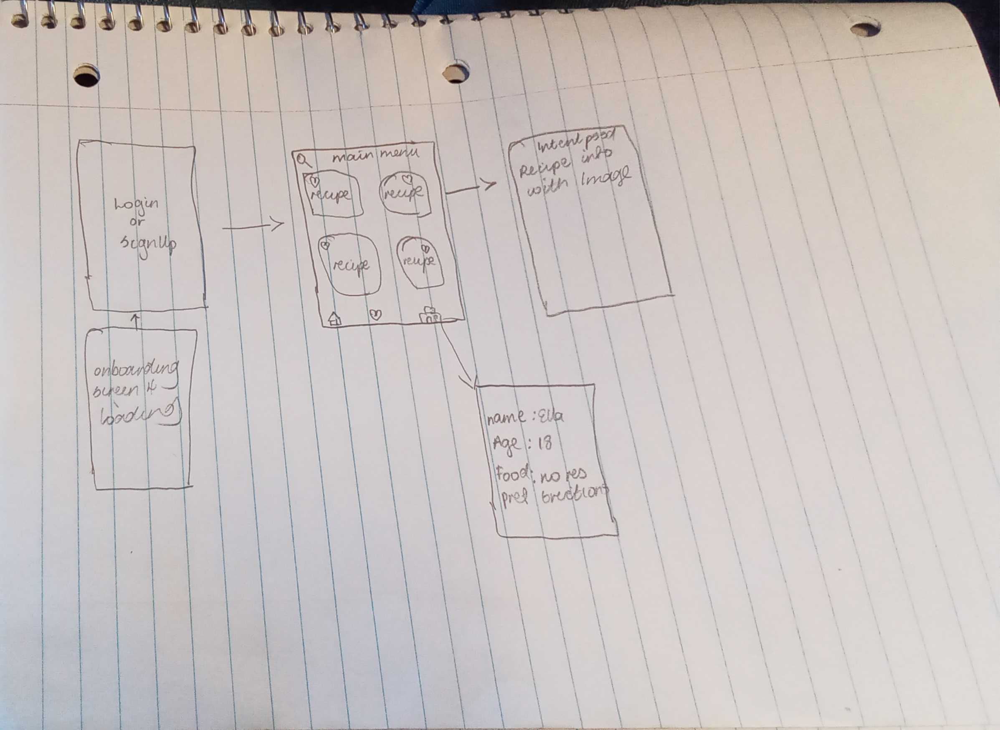

Original App Design Project - README Template
===

# Foodly

## Table of Contents
1. [Overview](#Overview)
1. [Product Spec](#Product-Spec)
1. [Wireframes](#Wireframes)
2. [Schema](#Schema)

## Overview
### Description
Get randomized suggestions for lunch/dinner menu based on the user’s preference

### App Evaluation
[Evaluation of your app across the following attributes]
- **Category:** Food, productivity, and health
- **Mobile:** This app is primarily developed for android phones. Functionality wouldn't be limited to mobile devices, however mobile version could potentially have more features.
- **Story:** Allows users to answer the question "What food do I eat?"
- **Market:** Everyone
- **Habit:** This app will be used when doesn't know what to eat.
- **Scope:** First we are oing to get food recipes then we are going to setup nofications to get reminders.

## Product Spec

### 1. User Stories (Required and Optional)

**Required Must-have Stories**

* Favorite food recipes
* Food recipes
* Food recipe description
* User settings
* Login
* SignUp
* SignOut
* Persistance
* Profile screen

**Optional Nice-to-have Stories**

* ML for food reccomendations
* Allow users to share recipes (different platforms like messaging, instagram, pinterest, and facebook)
* Allow users to post recipes
* ML library for text recognition
* Push Notifications for daily reminders

### 2. Screen Archetypes

* Login/SignUp Screen
   * Sign up
   * Log In
   * Persistence
* Stream Screen
   * Food recipes
* Details Food Recipe Screen
   * Food description
* Favorite Screen
   * Food recipes
* Profile Screen
  
### 3. Navigation

**Tab Navigation** (Tab to Screen)

* Home Feed
* Favorite Feed
* Profile Feed

**Flow Navigation** (Screen to Screen)

* Login/SignUp Screen
   * Stream/home Screen
* Home/Stream Screen
   * Details Screen

## Wireframes

### [BONUS] Digital Wireframes & Mockups

### [BONUS] Interactive Prototype

## Schema 
Data Models:
API: https://spoonacular.com/food-api/docs
Primary ID → Recipe ID → Type: Integer
Recipe Web URL →  Type: String
Recipe Photo URL → Type: String
Recipe Title → Type: String
Liked Recipe → Type: Image?
IngredientString → Type: String
recipeDescription → Type: Intent

Network Requests: Login Screen
Parse Server.
Login/Sign-Up: Post, Create, Update

Home Screen and Intent
Recipe Page and Intent: API Network Call

Favorite:
No API Network Call but database

Profile Page:
Parse Server.

### Models
[]
### Networking
- [Add list of network requests by screen ]
- [Create basic snippets for each Parse network request]
- [base url: https://api2.bigoven.com/recipes]
